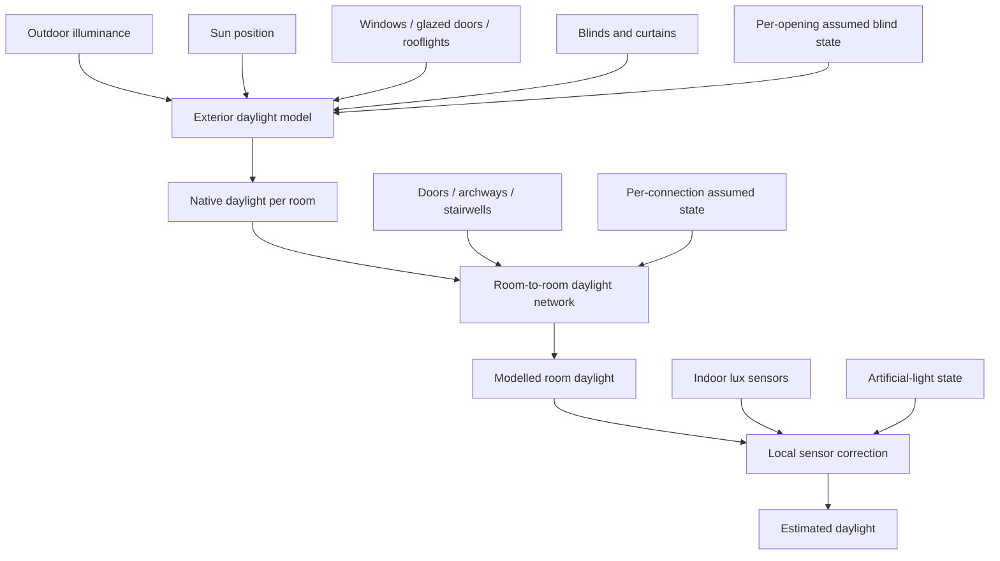

<p align="center">
  
</p>

# ☀️ Room Daylight — Natural-light estimation for Home Assistant

**Room Daylight** is a custom integration for [Home Assistant](https://www.home-assistant.io/) that estimates how much **natural daylight is available inside each room**.

Rather than using sunrise/sunset alone, Room Daylight combines your outdoor illuminance sensor with the sun's position, window and rooflight geometry, blinds or curtains, room-to-room openings, and optional indoor lux sensors. The result is a room-level lux estimate that can be used in automations to answer a simple question:

> **Is there already enough natural light in this room, or should the lights turn on?**

Room Daylight does not control your lights. It provides daylight sensors and diagnostics that your own Home Assistant automations can use however you want.

[](https://my.home-assistant.io/redirect/hacs_repository/?owner=AKruimink&repository=HA-Room-Daylight&category=integration)

> [!NOTE]
> Room Daylight is an automation-oriented daylight model. It is designed to produce a stable, explainable signal for Home Assistant, not to replace architectural daylight simulation or a calibrated lux survey.

## ✨ Features

- **Whole-house daylight model** — one integration entry contains all rooms and the connections between them.
- **Sun-aware exterior daylight** — uses outdoor illuminance together with sun azimuth and elevation.
- **Windows, glazed doors and rooflights** — exterior glazing is modelled as an oriented plane, so vertical windows and rooflights respond differently to the sun.
- **Rooms without windows** — hallways, landings and other internal rooms can receive daylight through neighbouring rooms.
- **Room-to-room daylight transfer** — model doors, archways, stairwells and custom openings between rooms.
- **Multi-hop transfer** — daylight can propagate across several connected rooms while remaining mathematically bounded.
- **Blinds and curtains** — optionally use Home Assistant `cover` entities, with a per-opening assumed state when no usable sensor state exists.
- **Door/opening state** — optionally use a `binary_sensor`, `input_boolean` or `cover`, with an independent assumed open/closed state for each connection.
- **Indoor lux correction** — local illuminance sensors can gently correct the model without affecting other rooms.
- **Artificial-light protection** — indoor sensor correction is suspended when configured room lights are on or their state is uncertain.
- **Explainable diagnostics** — see native daylight, transferred daylight, sensor correction, opening contributions and network convergence.
- **UI configuration** — configure the integration, rooms and connections from Home Assistant's interface.
- **Translations** — English, Dutch, French, German and Spanish are included.

## 📚 Table of contents

- [How it works](#-how-it-works)
- [Requirements](#-requirements)
- [Installation](#-installation)
- [Configuration](#-configuration)
  - [Global setup](#global-setup)
  - [Rooms](#rooms)
  - [Exterior glazed openings](#exterior-glazed-openings)
  - [Blinds and curtains](#blinds-and-curtains)
  - [Room connections](#room-connections)
  - [Model defaults](#model-defaults)
- [Entities and diagnostics](#-entities-and-diagnostics)
- [Automation examples](#-automation-examples)
- [Tuning the model](#-tuning-the-model)
- [Troubleshooting](#-troubleshooting)
- [Removal](#-removal)
- [Limitations](#-limitations)
- [Development](#-development)

## 🌤️ How it works

Room Daylight calculates daylight in stages. Outdoor conditions first determine how much daylight reaches each room directly through exterior glazing. The room network then allows some of that modelled daylight to pass through doors, archways and stairwells. Optional physical lux sensors are applied only at the end as a **local** correction.



The two opening concepts are deliberately separate:

- **Exterior glazed openings** admit daylight from outside into a room.
- **Room connections** transfer already-modelled daylight between configured rooms.

Indoor lux sensor readings are never fed into the room network, so a sensor sitting in a bright sun patch cannot artificially brighten neighbouring rooms.

### Bounded room network

Room-to-room transfer uses a bounded iterative solver. A connection can redistribute daylight from a brighter room towards a darker connected room, including across multiple hops, but network feedback cannot manufacture a room value brighter than the brightest reachable native daylight source.

The effect of a connection depends on its opening area, transmission, transfer efficiency and the floor area of the receiving room:

```text
connection weight = opening area
                    ÷ receiving room floor area
                    × transfer efficiency
                    × opening transmission
```

This means the same doorway can have a greater effect on a small hallway than on a large lounge.

## ✅ Requirements

- Home Assistant **2026.8.0 or newer**.
- An outdoor illuminance sensor with the `illuminance` device class.
- Home Assistant's `sun` integration, normally available as `sun.sun`.

Room Daylight has no third-party Python runtime dependencies.

## 📦 Installation

### HACS

The recommended installation method is [HACS](https://hacs.xyz/).

1. Open **HACS** in Home Assistant.
2. Add `https://github.com/AKruimink/HA-Room-Daylight` as a custom **Integration** repository if it is not already available.
3. Find and install **Room Daylight**.
4. Restart Home Assistant.
5. Go to **Settings → Devices & services → Add integration**.
6. Search for **Room Daylight** and complete the setup flow.

You can also use the HACS button near the top of this README to open the repository directly in Home Assistant.

### Manual installation

Copy the complete directory:

```text
custom_components/room_daylight/
```

into your Home Assistant configuration directory so the final path is:

```text
/config/custom_components/room_daylight/
```

Restart Home Assistant, then go to **Settings → Devices & services → Add integration** and search for **Room Daylight**.

## ⚙️ Configuration

Room Daylight is configured entirely through the Home Assistant UI.

It uses a single top-level integration entry for the house-wide daylight environment. **Rooms** and **room connections** are then added underneath it as independently configurable subentries.

### Global setup

During initial setup, choose:

| Setting | Description |
| --- | --- |
| **Outdoor illuminance** | Exterior lux sensor shared by the complete model. |
| **Sun entity** | Home Assistant sun entity, normally `sun.sun`. |
| **Model defaults** | Starting values applied when rooms, glazing and connections are created. |

Completing this step creates the Room Daylight integration itself. **You do not need to create a room or connection during initial setup.** An empty Room Daylight entry is valid and can stay that way until you are ready to build the model.

After setup, open the Room Daylight integration entry whenever you want to add, reconfigure or remove rooms and connections. Add rooms first; connections can then be created between any two configured rooms.

### Rooms

A room represents one physical space in the house.

For each room you can configure:

| Setting | Description |
| --- | --- |
| **Name** | Human-readable room name. |
| **Floor area** | Approximate room floor area in square metres. |
| **Home Assistant area** | Optional HA area association. |
| **Exterior glazed openings** | Zero or more windows, glazed exterior doors or rooflights. |
| **Indoor lux sensors** | Optional local illuminance sensors used for final correction. |
| **Artificial lights** | Optional entities whose light output can influence the indoor lux sensors. |
| **Daylight utilisation** | Room-specific efficiency for converting admitted exterior light into useful room illuminance. |
| **Sensor correction strength** | How strongly valid indoor sensor readings influence the final estimate. |

A room may have **zero exterior openings**. This is useful for hallways, landings and internal rooms that receive daylight only through connected spaces.

Room identity is based on Home Assistant's stable config-subentry ID, so renaming a room does not change its entity unique IDs or break configured connections.

### Exterior glazed openings

An exterior glazed opening is any glazed surface that admits daylight directly from outdoors, including:

- normal windows;
- glazed exterior doors;
- French or patio doors;
- sliding glass doors;
- rooflights;
- skylights.

Room Daylight supports three opening types.

#### Wall window / glazed exterior door

Configure the opening's name, width, height, outward-facing direction, transmission and optional blind/curtain entity. Wall glazing is modelled as a vertical surface.

#### Rooflight / skylight

Configure the name, width, length, roof pitch, facing direction, transmission and optional blind entity.

A flat rooflight uses a roof pitch of **0°**. Its facing direction has no practical effect because the surface points directly upwards.

#### Custom opening

Use a custom opening for unusual glazing. Width, height, azimuth and tilt can be specified directly.

#### Orientation reference

Azimuth is measured clockwise from north:

| Direction | Azimuth |
| --- | ---: |
| North | 0° |
| East | 90° |
| South | 180° |
| West | 270° |

Tilt is measured from horizontal:

| Surface | Tilt |
| --- | ---: |
| Flat sky-facing rooflight | 0° |
| 35° pitched rooflight | 35° |
| Vertical wall glazing | 90° |

The direct daylight contribution is based on the angle between the sun and the glazed surface. This is why a rooflight naturally behaves differently from a wall window as the sun rises and sets.

### Blinds and curtains

Each exterior opening has an **Assumed blind state** and can optionally reference a Home Assistant `cover` entity. This makes the behaviour explicit even when a blind or curtain is not automated.

For example, two windows in the same room can be configured independently:

- a normally uncovered window can assume **Open**;
- a window whose blind is normally kept down can assume **Closed**.

New exterior openings default to **Open**, because no configured cover often means there is no blind or curtain being modelled. You can change that assumption for each opening.

When a configured cover has a usable state, that live state overrides the assumption. If it exposes `current_position`, Room Daylight uses the position continuously:

- `0%` = fully closed;
- `100%` = fully open.

If no position is available, the normal open/closed cover state is used. If no cover entity is configured, or the configured entity is missing, `unknown` or `unavailable`, Room Daylight falls back to that opening's **Assumed blind state**.

### Room connections

A room connection represents a physical opening through which daylight can pass between two configured rooms.

Supported connection types are:

| Type | Typical use |
| --- | --- |
| **Door / doorway** | Standard internal door or doorway. |
| **Open archway** | Unobstructed connection between two rooms. |
| **Stairwell** | Stair or floor opening connecting spaces. |
| **Custom opening** | Other internal opening geometry. |

A connection belongs to the relationship between two rooms rather than either room individually, so each physical doorway only needs to be configured once. Multiple connections between the same two rooms are allowed.

#### Door/opening state

Every connection has an **Assumed connection state** and can optionally use a Home Assistant state entity:

- `binary_sensor`;
- `input_boolean`;
- `cover`.

The assumption is stored on the individual connection, so an always-open kitchen doorway and a normally closed office door can behave differently even if neither has a sensor.

New connections start with sensible type-specific assumptions:

| Connection type | Initial assumed state |
| --- | --- |
| **Door / doorway** | Closed |
| **Open archway** | Open |
| **Stairwell** | Open |
| **Custom opening** | Open |

These are only starting values and can be changed per connection.

When a configured state entity has a usable value, that live state overrides the assumption. For binary-style entities, `on` means open and `off` means closed. **Invert state** can be enabled for devices with opposite semantics. Position-aware covers can vary continuously between closed and fully open.

If no state entity is configured, or the configured entity is missing, `unknown` or `unavailable`, Room Daylight falls back to that connection's **Assumed connection state**. Inversion applies only to a valid entity state; it does not invert the configured assumption.

#### Closed transmission

A closed connection does not have to block all daylight. **Closed transmission** controls how much light may still pass while the opening is closed.

Examples:

| Opening | Example closed transmission |
| --- | ---: |
| Solid internal door | `0.00` |
| Partially glazed internal door | `0.15` |
| Open archway / unobstructed opening | `1.00` |

These are examples, not prescribed values; tune them for your home.

### Model defaults

Initial setup provides defaults used when new rooms, exterior openings and connections are created.

| Parameter | Default | Description |
| --- | ---: | --- |
| **Diffuse daylight fraction** | `0.35` | Share of the exterior model attributed to diffuse sky light. |
| **Glazing transmission** | `0.70` | Default optical transmission of exterior glazing. |
| **Daylight utilisation** | `0.35` | How effectively admitted daylight contributes to useful room illuminance. |
| **Room-to-room transfer efficiency** | `0.65` | Default efficiency of internal openings. |
| **Indoor sensor correction strength** | `0.35` | Blend between modelled daylight and local physical lux sensors. |

These are deliberately starting values rather than universal physical constants. Glazing, room geometry, decoration and sensor placement vary considerably from one home to another.

## 📊 Entities and diagnostics

Each configured room exposes an enabled **Estimated daylight** sensor in lux. This is the primary entity intended for dashboards and automations.

Room Daylight also creates diagnostic entities that are disabled by default:

| Entity | Meaning |
| --- | --- |
| **Native daylight** | Daylight reaching the room directly through exterior glazing. |
| **Transferred daylight** | Additional modelled daylight attributed to connected rooms. |
| **Indoor sensor median** | Median of currently valid local lux sensor readings. |
| **Indoor sensor adjustment** | Correction being applied from physical sensors. |
| **Effective daylight ratio** | Relationship between estimated indoor daylight and outdoor illuminance. |

Enable diagnostics from the Home Assistant entity registry when you want to tune or investigate a room.

The main Estimated daylight sensor also exposes detailed attributes for:

- individual exterior-opening contributions;
- incidence and sky-view factors;
- cover openness, assumed state, state source and effective transmission;
- room-connection assumed/live state, weights and transmission;
- per-connection daylight contribution;
- sensor correction state;
- network iteration count and convergence.

### Indoor lux sensor correction

Indoor lux sensors are optional. When configured, their median valid reading is used as a final room-local correction after the exterior model and room network have already been calculated.

Correction is suppressed while any configured artificial-light entity is on. It is also suppressed if a configured artificial-light state is unknown or unavailable, which prevents electric light from being learned as natural daylight.

The underlying modelled daylight remains available even while correction is suppressed.

## 🤖 Automation examples

The Estimated daylight entity behaves like a normal illuminance sensor, so it can be used directly in Home Assistant automations.

### Only turn on a light when the room is dark enough

```yaml
condition:
  - condition: numeric_state
    entity_id: sensor.living_room_estimated_daylight
    below: 80
```

Use a threshold that matches the room and the behaviour you want. There is no single lux value that is correct for every room or activity.

### Turn a hallway light on when occupied and daylight is low

```yaml
alias: Hallway light when dark
triggers:
  - trigger: state
    entity_id: binary_sensor.hallway_motion
    to: "on"
conditions:
  - condition: numeric_state
    entity_id: sensor.hallway_estimated_daylight
    below: 60
actions:
  - action: light.turn_on
    target:
      entity_id: light.hallway
mode: restart
```

Entity IDs in these examples are illustrative; use the entities created in your Home Assistant instance.

## 🎛️ Tuning the model

A good starting workflow is:

1. Configure the room dimensions and exterior openings as accurately as practical.
2. Verify opening orientation, roof pitch and cover state.
3. Add internal room connections and check their diagnostics.
4. Observe **Native daylight** and **Transferred daylight** before adjusting model parameters.
5. Add indoor lux sensors only after the geometric model behaves sensibly.
6. Tune daylight utilisation, transmission and correction strength gradually rather than changing several parameters at once.

Physical indoor sensors are best used as a correction to a sensible geometric model, not as a replacement for it.

## 🆘 Troubleshooting

### Estimated daylight stays at 0 lx

Check that:

- the outdoor illuminance sensor has a valid, non-negative reading;
- the configured sun entity is available;
- the room has a usable exterior opening, or a connection to another room receiving daylight;
- the opening's assumed blind state and any configured cover state match the real blind/curtain position.

The Estimated daylight sensor attributes contain additional opening and environment diagnostics.

### A connected room receives no transferred daylight

Check that:

- both connected rooms still exist;
- the opening dimensions are sensible;
- the connection's assumed state is appropriate when no usable state entity is available;
- any configured state entity reports the expected open/closed state;
- **Closed transmission** is non-zero if you expect light through a closed door;
- transfer efficiency is not configured unusually low.

The connection diagnostics on the Estimated daylight sensor show the current transmission, transfer weight and contribution.

### Indoor sensor correction is not being applied

Correction is deliberately disabled if a configured artificial-light entity is:

- on;
- missing;
- unknown;
- unavailable.

Also confirm that at least one configured indoor lux sensor currently has a valid numeric reading.

### `network_converged` is false

The network solver has a hard iteration limit so unusual configurations cannot iterate indefinitely.

A non-converged result should be uncommon with realistic room sizes and opening dimensions. Check for very large internal openings, extremely small receiving rooms or unusually high transfer efficiencies. The solver remains bounded even if it reaches the iteration limit.

### Enable debug logging

If you need more detail while diagnosing a problem, enable debug logging for the integration:

```yaml
logger:
  default: warning
  logs:
    custom_components.room_daylight: debug
```

Restart Home Assistant, reproduce the issue, and include the relevant log entries and room diagnostics when opening an issue.

## 🗑️ Removal

### Remove Room Daylight from Home Assistant

1. Go to **Settings → Devices & services → Integrations**.
2. Open **Room Daylight**.
3. Choose **Delete** / **Remove integration**.
4. Confirm the removal.

This removes the integration entry, its room/connection subentries and its entities from Home Assistant.

### Remove the installed files

If installed through HACS:

1. Open HACS.
2. Find **Room Daylight**.
3. Uninstall it.
4. Restart Home Assistant if prompted.

For a manual installation, delete:

```text
/config/custom_components/room_daylight/
```

and restart Home Assistant.

### Remove only a room or connection

Rooms and connections can be managed independently beneath the Room Daylight integration entry.

When removing a room, remove any room connections that reference it first so the configured network remains clear and consistent.

## ℹ️ Limitations

Room Daylight deliberately does not attempt to model:

- detailed room shape or sensor coordinates;
- wall and ceiling reflectance;
- multiple internal reflections;
- exterior obstructions such as neighbouring buildings, trees or overhangs;
- detailed sky luminance distributions beyond the selected outdoor illuminance source;
- spectral glazing properties;
- photometric ray tracing.

Treat the result as a **consistent automation signal that can be tuned for your home**, rather than an architectural compliance measurement.

## 🛠️ Development

The exterior daylight calculation, configuration models and room-network solver are intentionally separated from Home Assistant-specific orchestration so their behaviour can be tested independently.

Run the test suite with:

```bash
python -m pip install pytest
python -m pytest -v
```

For implementation details, mathematical invariants and Home Assistant lifecycle notes, see [ARCHITECTURE.md](ARCHITECTURE.md).

## 💬 Issues and feedback

If you find a bug or have a real-world case that the model does not handle well, please [open an issue](https://github.com/AKruimink/HA-Room-Daylight/issues) and include the relevant room/opening configuration, diagnostics and logs where possible.
